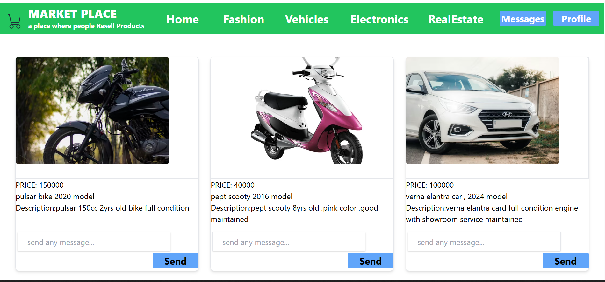
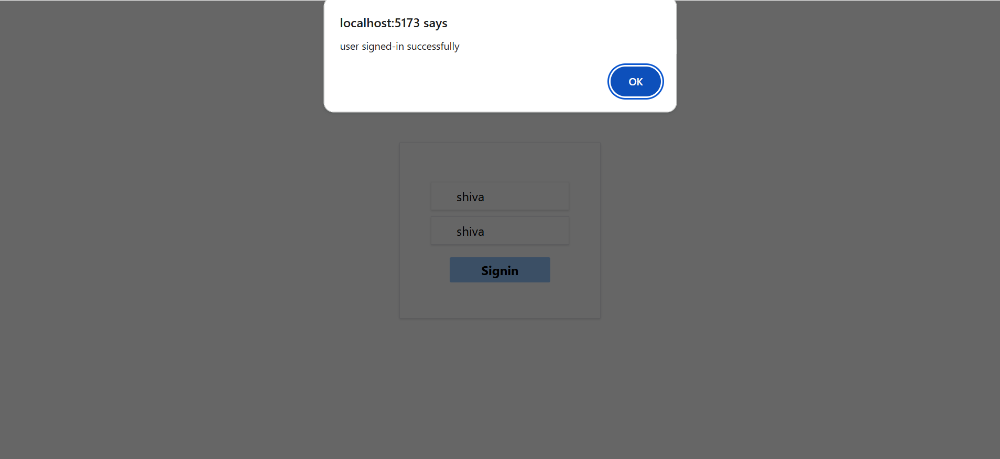
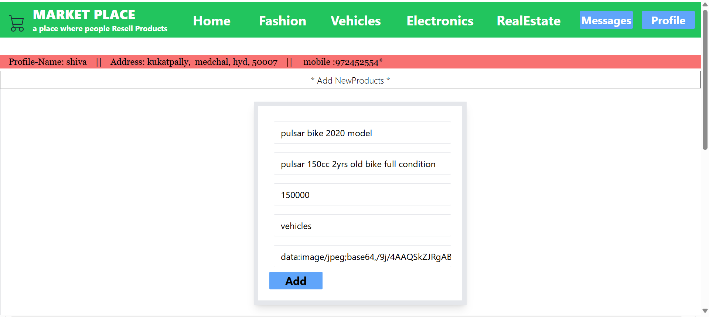
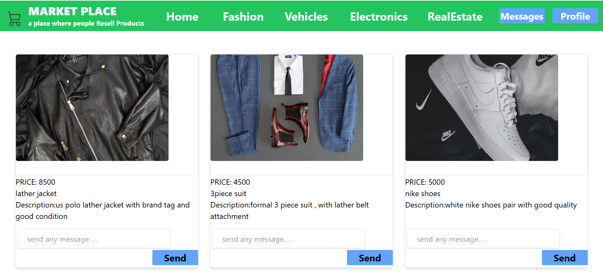
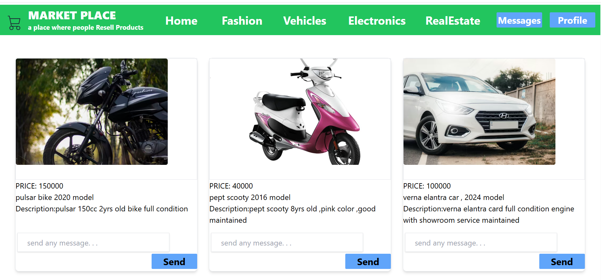
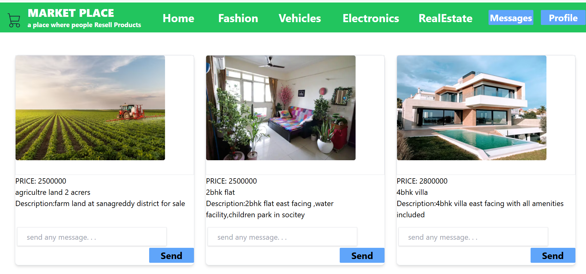
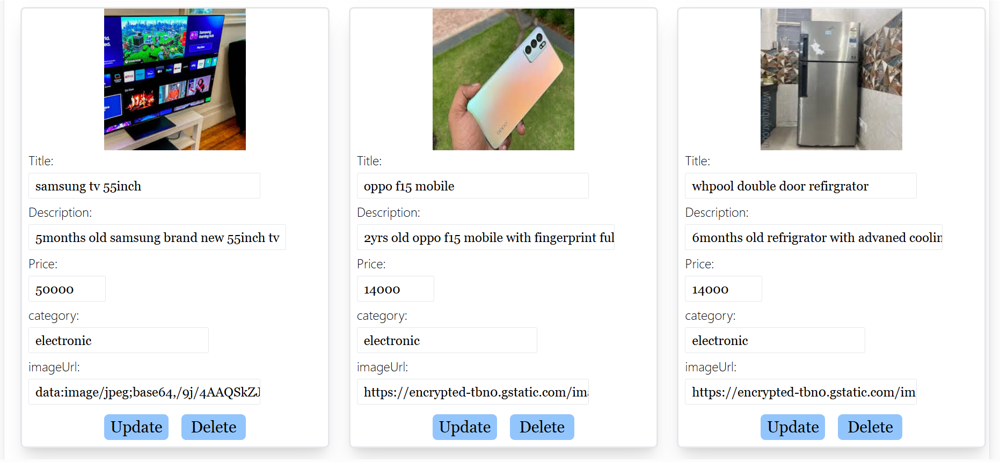

# 🛒 Marketplace App

A full-stack **product marketplace application** where users can browse categories, post products, send messages, and manage their profile with secure authentication.

Built with:

* ⚛️ **React (Vite + TypeScript)** frontend
* 🔐 **Node.js + Express + MongoDB + JWT** backend
* 🎨 **Tailwind / Custom Components** for styling

---

## 📸 Screenshots

### 🏠 Home Page



### 🔐 Sign In Page



### 🆕 Sign Up Page


### ➕ Add Product Page



### 👗 Fashion Category



### 🚗 Vehicle Category



### 🏢 Real Estate Category



### 🔁 Update Product



---

## 📂 Folder Structure

```
project-root/
│
├── assets/
│   ├── homePage.png
│   ├── signinPage.png
│   ├── signupPage.png
│   ├── addProduct.png
│   ├── fashion.png
│   ├── vehicle.png
│   ├── realEstatePage.png
│   └── updateProduct.png
│
├── frontend/
│   ├── src/
│   │   ├── components/
│   │   ├── layout/
│   │   ├── loaders/
│   │   ├── pages/
│   │   ├── App.tsx
│   │   ├── main.tsx
│   │   └── App.css
│   ├── package.json
│   └── vite.config.ts
│
├── backend/
│   ├── src/
│   │   ├── controllers/
│   │   ├── routes/
│   │   ├── middleware.js
│   │   ├── config.js
│   │   └── db.js
│   └── package.json
│
└── README.md
```

---

## 🚀 Features

### 🧍 User Authentication

* Sign-up / Sign-in with JWT Tokens
* Only authenticated users can upload products

### 🛒 Marketplace

* Browse multiple product categories:

  * Electronics
  * Fashion
  * Vehicles
  * Houses & Apartments
* Filtered view per category

### ➕ Product Management

* Add new product
* Update product
* Rich cards UI for all posts

### 💬 Messaging

* Message system for enquiries and negotiations

### 🔁 Global Product Loader

* `useProductLoader()` fetches all products automatically across screens

---

## 🧠 Tech Stack

### 🖥️ Frontend

* React + TypeScript + Vite
* React Router
* Tailwind / Custom CSS Components

### ⚙️ Backend

* Node.js + Express
* MongoDB + Mongoose
* JWT Authentication
* REST API Architecture

---

## 🛠️ Setup Instructions

### 📦 1. Clone the Repository

```bash
git clone https://github.com/yourgithubusername/marketplace-app.git
cd marketplace-app
```

### 💻 2. Frontend Setup

```bash
cd frontend
npm install
npm run dev
```

Runs at 👉 `http://localhost:5173`

### ⚙️ 3. Backend Setup

```bash
cd backend
npm install
npm start
```

Runs at 👉 `http://localhost:5000`

---

## 🔑 Environment Variables

Create a `.env` file inside the `backend/` folder:

```
MONGO_URL = your_mongodb_connection_string
JWT_SECRET_KEY = your_secret
PORT = 5000
```

---

## 📡 API Endpoints

### 👤 Users

| Method | Endpoint  | Description        |
| ------ | --------- | ------------------ |
| POST   | `/signup` | User registration  |
| POST   | `/signin` | User login & token |

### 🛍️ Products

| Method | Endpoint               | Description        |
| ------ | ---------------------- | ------------------ |
| GET    | `/products`            | Fetch all products |
| POST   | `/products/add`        | Add new product    |
| PUT    | `/products/update/:id` | Update product     |
| DELETE | `/products/delete/:id` | Remove product     |

### 💬 Messaging

| Method | Endpoint               | Description  |
| ------ | ---------------------- | ------------ |
| POST   | `/message/send`        | Send message |
| GET    | `/message/:receiverId` | Get messages |

---

## 📊 App Overview

The dashboard allows users to:

* Explore all products by category
* View detailed profile info
* Send/receive messages
* Add and update listings

All data updates dynamically with loaders and React state.

---

## 👨‍💻 Author

Developed by **Sai Patel**
✨ “A simple and smart way to buy and sell products.”

---

## 📄 License

This project is **Open Source** and distributed under the **MIT License**.

---

If you want, I can also generate:
✔️ Badges (Tech badges)
✔️ Demo GIF banner
✔️ `CONTRIBUTING.md`
✔️ `API Documentation.md`

Just tell me 🔥
